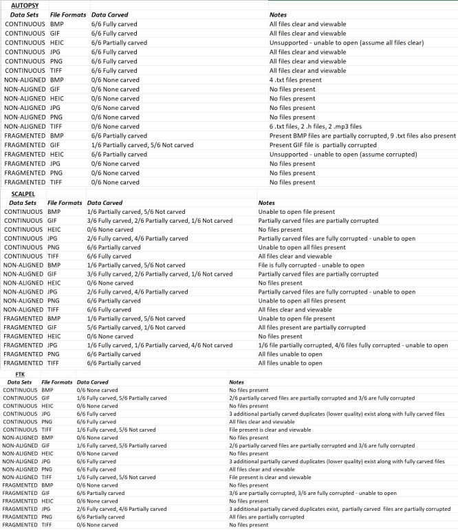
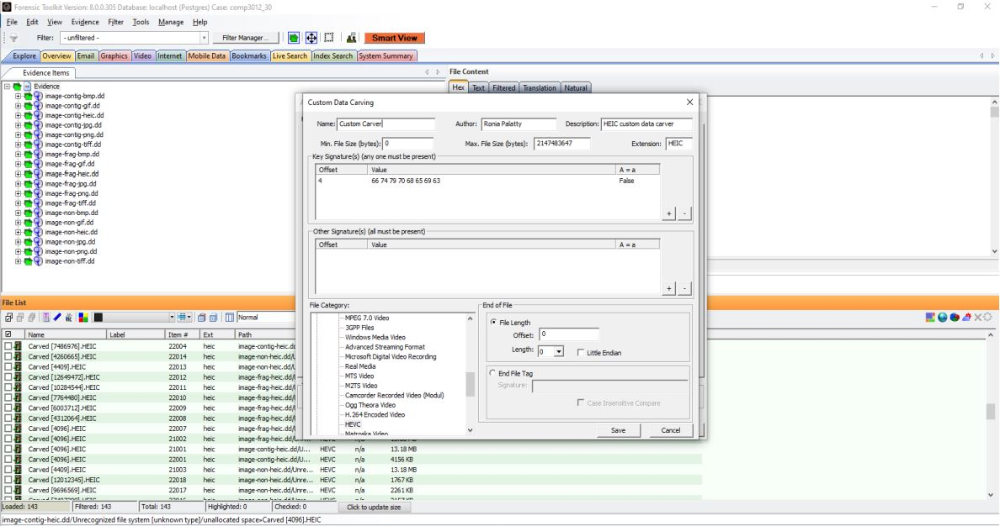
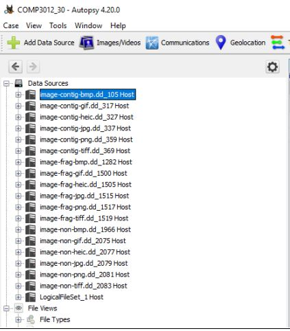
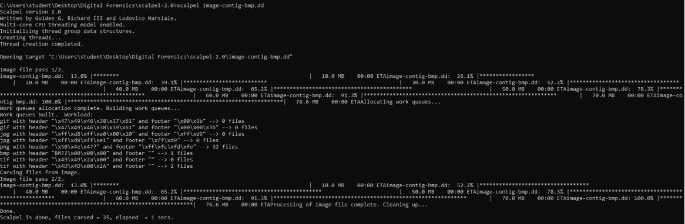

# Digital Forensics & Keylogger Investigation

**Module:** COMP3012 – Digital Forensics and Malware Analysis  

## Overview
Conducted data carving experiments and produced a forensic investigation report based on a simulated keylogger incident.
Demonstrated skills in incident response, forensic analysis, and root cause investigation.

## Tools Used
- Autopsy, FTK, Scalpel, Sleuth Kit  
- Volatility (conceptual)  
- NIST Data Carving Test Images  

## Key Work
- Compared carving tools across continuous, non-aligned, and fragmented data  
- Analysed multiple file types (JPG, PNG, BMP, GIF, TIFF, HEIC)  
- Developed a custom HEIC carver in FTK  

## Skills Demonstrated
- Digital forensics & evidence handling  
- Data carving & artifact analysis  
- Timeline reconstruction  
- Technical reporting  

## Reports
- [Data Carving Report](reports/carving-tools-report.pdf)  
- [Keylogger Investigation Report](reports/keylogger-tender-report.pdf)  

## Screenshots

